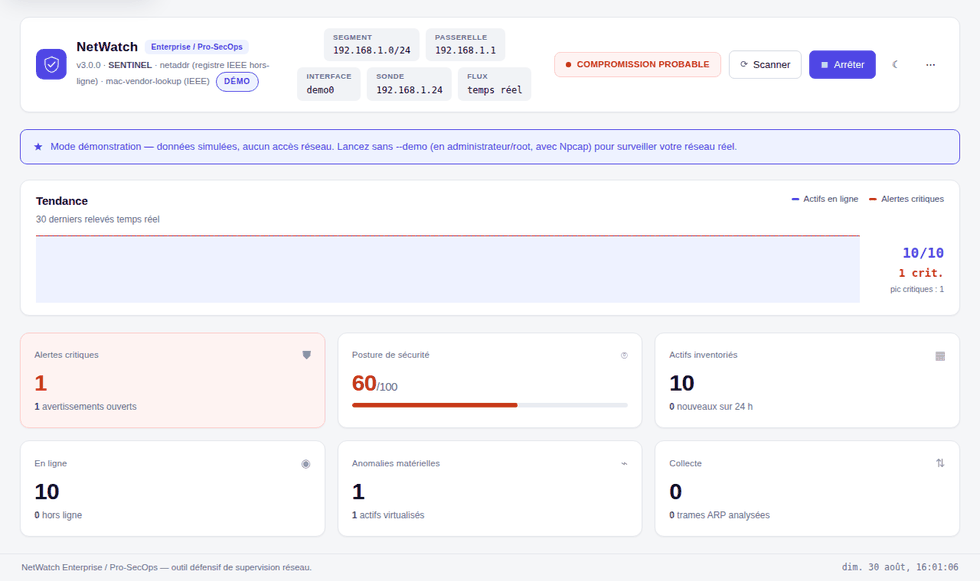
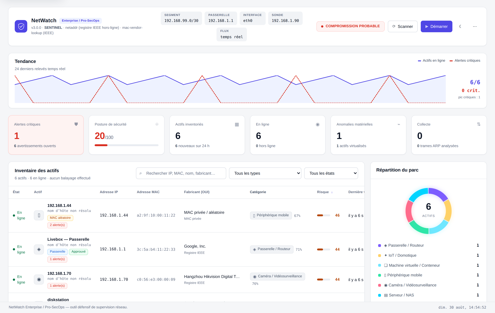
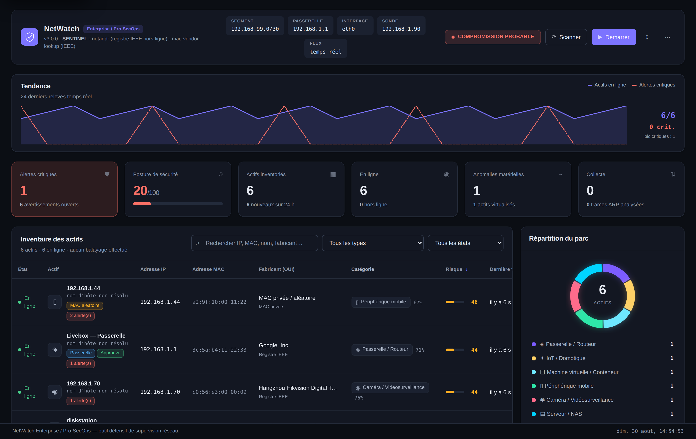
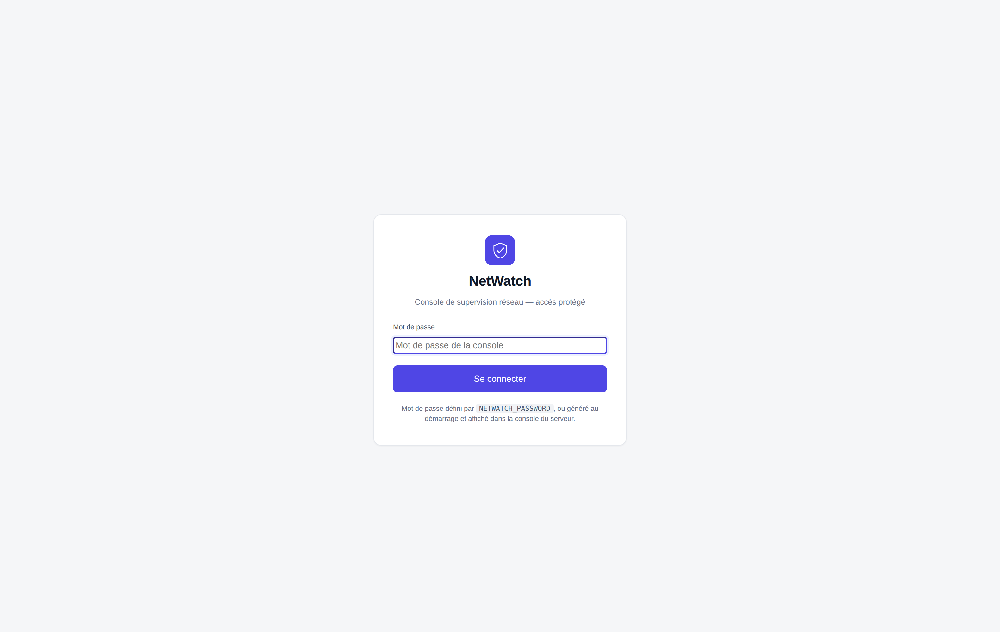
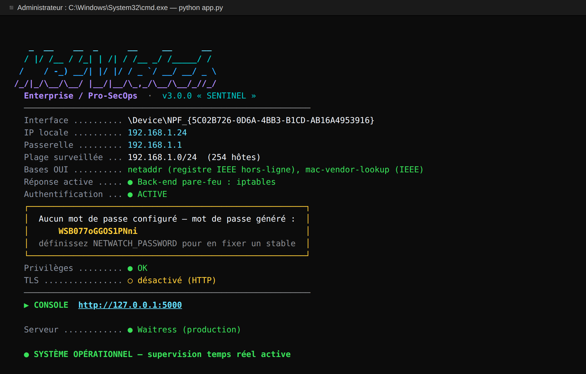

<div align="center">

# 🛡️ NetWatch — Enterprise / Pro-SecOps

**Console défensive de supervision réseau : détection d'empoisonnement ARP,
inventaire intelligent des actifs et réponse locale — en temps réel.**

[](LICENSE)
[](https://www.python.org/)
[](https://react.dev/)
[](https://www.typescriptlang.org/)
[](https://scapy.net/)
[](#-tests)



<em>Essai immédiat, sans réseau ni privilèges :</em>

```bash
pip install -r requirements.txt
python app.py --demo
```

</div>

> [!WARNING]
> **Outil strictement défensif.** À utiliser uniquement sur un réseau dont
> vous êtes propriétaire ou pour lequel vous avez une **autorisation écrite**.
> NetWatch n'émet aucune trame ARP forgée et ne réalise aucune contre-attaque.
> Voir [SECURITY.md](SECURITY.md).

---

## ✨ Fonctionnalités

- **Mode démonstration** — `python app.py --demo` peuple la console avec une
  flotte simulée (10 actifs, scénarios d'attaque) : découverte complète en
  quelques secondes, **sans réseau, sans privilèges, sans risque**.
- **Export SIEM** — diffusion des alertes vers un **webhook** (Slack/Teams/HTTP)
  et/ou un serveur **syslog** (RFC 3164), avec seuil de sévérité configurable.
- **Détection d'attaques ARP en temps réel** — empoisonnement de cache,
  usurpation de passerelle, MAC associée à plusieurs IP, flood de réponses ARP
  gratuites (référencées MITRE ATT&CK **T1557.002**).
- **Double collecte** — balayage ARP actif (Scapy) + sniffer passif continu.
- **Identification fabricant quasi-exhaustive** — base OUI IEEE hors-ligne via
  `netaddr` (~35 000 préfixes) + `mac-vendor-lookup`, avec gestion des MAC
  virtuelles (VMware, Hyper-V, QEMU…) et aléatoires (anti-tracking iOS/Android).
- **Typage intelligent des actifs** — score pondéré combinant fabricant OUI,
  nom d'hôte DNS et services exposés (passerelle, serveur/NAS, poste, mobile,
  caméra, IoT…), avec faisceau de preuves consultable.
- **Réponse active locale & réversible** — mise en quarantaine d'un actif par
  règle de **pare-feu de l'hôte** (`netsh` / `iptables`), jamais par ARP forgé.
- **Interface temps réel** — flux Server-Sent Events (un producteur, N clients),
  mises à jour **optimistes** (aucune latence perçue).
- **UI moderne** — React + TypeScript, thèmes **clair/sombre**, responsive
  (mobile → grand écran), accessible (navigation clavier, ARIA, WCAG AA),
  skeleton screens, graphique de tendance.
- **Sécurité applicative** — authentification par session (cookie HttpOnly),
  **protection CSRF**, anti-bruteforce par IP, en-têtes de sécurité, HTTPS
  optionnel, journal d'audit tournant.

## 🖼️ Aperçu

| Thème clair | Thème sombre |
|---|---|
|  |  |

| Connexion | Console de démarrage |
|---|---|
|  |  |

## 🏗️ Architecture

```
netwatch_enterprise/
├── app.py                  API JSON Flask + flux SSE + service du SPA + auth/CSRF
├── config.py               Configuration (surchargée par variables NETWATCH_*)
├── core/
│   ├── monitor.py          Collecte ARP (active + passive) & moteur de détection
│   ├── database.py         Persistance thread-safe (inventaire, alertes, audit)
│   ├── resolver.py         Identification fabricant (OUI) & typage d'actifs
│   ├── responder.py        Réponse active : quarantaine par pare-feu local
│   ├── notifier.py         Export SIEM des alertes (webhook / syslog)
│   ├── demo.py             Simulateur du mode démonstration
│   └── auth.py             Mot de passe, sessions, jetons CSRF
├── frontend/               Console React + TypeScript (Vite)
│   ├── src/                Composants, store (Zustand), hooks, client API typé
│   └── dist/               Build servi par Flask (inclus pour lancement direct)
├── tools/generate_cert.py  Génération d'un certificat TLS auto-signé
├── simulate_detection.py   Banc de test de la détection (aucune trame émise)
├── tests/                  Suite pytest (API, auth/CSRF, détection, persistance)
├── Dockerfile · docker-compose.yml
└── .github/workflows/ci.yml
```

**Backend Python (Flask + Scapy)** : cœur de collecte et de détection, exposé
comme **API JSON pure** + **flux temps réel SSE**. **Front-end React/TypeScript**
compilé et servi par Flask (une seule origine).

## 📦 Prérequis

- **Python 3.11+**
- **Node.js 18+** (uniquement pour recompiler l'interface ; un build est fourni)
- **Windows** : [Npcap](https://npcap.com) (mode « WinPcap API-compatible ») +
  terminal **administrateur**
- **Linux/macOS** : `libpcap` + privilèges `root` (ou capacités `CAP_NET_RAW`)

## 🚀 Installation & lancement

```bash
# 1) Backend
pip install -r requirements.txt

# 2) Front-end (facultatif : un build est déjà inclus dans frontend/dist)
cd frontend && npm install && npm run build && cd ..

# 3a) Découverte immédiate — données simulées, aucun privilège requis
python app.py --demo

# 3b) Surveillance réelle  (Windows : terminal administrateur ; Linux : sudo)
python app.py
```

Ouvrez ensuite **http://127.0.0.1:5000**. La collecte démarre automatiquement.
Si aucun mot de passe n'est configuré, un mot de passe aléatoire est **affiché
dans la console** au démarrage.

### Options en ligne de commande

Toutes ces options ont un équivalent `NETWATCH_*` (voir plus bas) ; les
arguments CLI ont priorité.

| Argument | Rôle |
|---|---|
| `--demo` | Mode démonstration (flotte simulée, aucun accès réseau) |
| `--host <ip>` | Adresse d'écoute (défaut `127.0.0.1`) |
| `--port <n>` | Port d'écoute (défaut `5000`) |
| `--target <cidr>` | Plage à surveiller (ex. `192.168.1.0/24`) |
| `--password <mdp>` | Mot de passe de la console |
| `--no-auth` | Désactive l'authentification (développement uniquement) |
| `--no-browser` | N'ouvre pas le navigateur au démarrage |

### Développement de l'interface (rechargement à chaud)

```bash
python app.py                 # terminal 1 — backend (port 5000)
cd frontend && npm run dev    # terminal 2 — Vite (port 5173, relaie /api)
```

## ⚙️ Configuration

Toutes les options se règlent par variables d'environnement `NETWATCH_*` :

| Variable | Défaut | Rôle |
|---|---|---|
| `NETWATCH_PASSWORD` | *(généré)* | Mot de passe de la console |
| `NETWATCH_HOST` / `NETWATCH_PORT` | `127.0.0.1` / `5000` | Adresse d'écoute |
| `NETWATCH_TARGET_NETWORK` | *(auto /24)* | Plage à surveiller (ex. `192.168.1.0/24`) |
| `NETWATCH_SCAN_INTERVAL` | `25` | Intervalle des balayages ARP (s) |
| `NETWATCH_STREAM_INTERVAL` | `2.0` | Cadence du flux temps réel (s) |
| `NETWATCH_ENABLE_SNIFFER` | `1` | Sniffer ARP passif |
| `NETWATCH_ENABLE_PORT_PROBE` | `1` | Sonde TCP légère (affine le typage) |
| `NETWATCH_ENABLE_RESPONSE` | `1` | Bouton « Isoler » (quarantaine locale) |
| `NETWATCH_TLS_CERT` / `NETWATCH_TLS_KEY` | — | Active HTTPS |
| `NETWATCH_AUTH_ENABLED` | `1` | Authentification (à ne désactiver qu'en dev) |
| `NETWATCH_WEBHOOK_URL` | — | Export des alertes vers un webhook (Slack/Teams/HTTP) |
| `NETWATCH_SYSLOG_HOST` / `NETWATCH_SYSLOG_PORT` | — / `514` | Export syslog (UDP, RFC 3164) |
| `NETWATCH_NOTIFY_MIN_SEVERITY` | `warning` | Seuil d'export (`info`/`warning`/`critical`) |

### 📡 Export SIEM (webhook / syslog)

NetWatch diffuse chaque nouvelle alerte au-delà d'un seuil de sévérité vers un
webhook HTTP et/ou un serveur syslog, sans jamais bloquer la détection (envoi
asynchrone, best-effort).

```bash
# Webhook (payload JSON avec un champ « text » compatible Slack/Teams)
set NETWATCH_WEBHOOK_URL=https://hooks.slack.com/services/XXX/YYY/ZZZ

# Syslog (transfert vers un collecteur SIEM : Wazuh, Graylog, Splunk…)
set NETWATCH_SYSLOG_HOST=10.0.0.20
set NETWATCH_SYSLOG_PORT=514

# N'exporter que les alertes critiques
set NETWATCH_NOTIFY_MIN_SEVERITY=critical

python app.py
```

Les deux canaux peuvent être actifs simultanément. L'état de l'export est
visible dans l'API (`/api/state` → `notifier`) et au démarrage dans la console.

### HTTPS

```bash
python tools/generate_cert.py            # certificat auto-signé dans data/
set NETWATCH_TLS_CERT=...\data\cert.pem  # (export sous Linux/macOS)
set NETWATCH_TLS_KEY=...\data\key.pem
python app.py                            # la console passe en https://
```

## 🐳 Docker

```bash
docker compose up --build
```

> Le conteneur tourne en `network_mode: host` avec `NET_RAW`/`NET_ADMIN` :
> indispensable pour que Scapy voie le vrai segment L2. Voir
> [`docker-compose.yml`](docker-compose.yml).

## 🧪 Tests

```bash
# Backend (36 tests)
pip install -r requirements-dev.txt
pytest

# Front-end (14 tests) + lint
cd frontend && npm run test && npm run lint

# Valider la détection sans émettre de trafic (paquets ARP synthétiques)
python simulate_detection.py
```

L'intégration continue ([GitHub Actions](.github/workflows/ci.yml)) exécute
automatiquement pytest, ESLint, Vitest et le build à chaque *push*.

## 🔒 Sécurité

Consultez **[SECURITY.md](SECURITY.md)** pour le cadre d'utilisation, les
bonnes pratiques de déploiement et le signalement de vulnérabilités.

## 🤝 Contribution

Les *issues* et *pull requests* sont les bienvenues. Merci de faire passer
`pytest`, `npm run test` et `npm run lint` avant toute PR.

## 📄 Licence

Distribué sous licence **MIT** — voir [LICENSE](LICENSE).

---

<div align="center">
<sub>NetWatch Enterprise / Pro-SecOps — outil défensif de supervision réseau.</sub>
</div>
